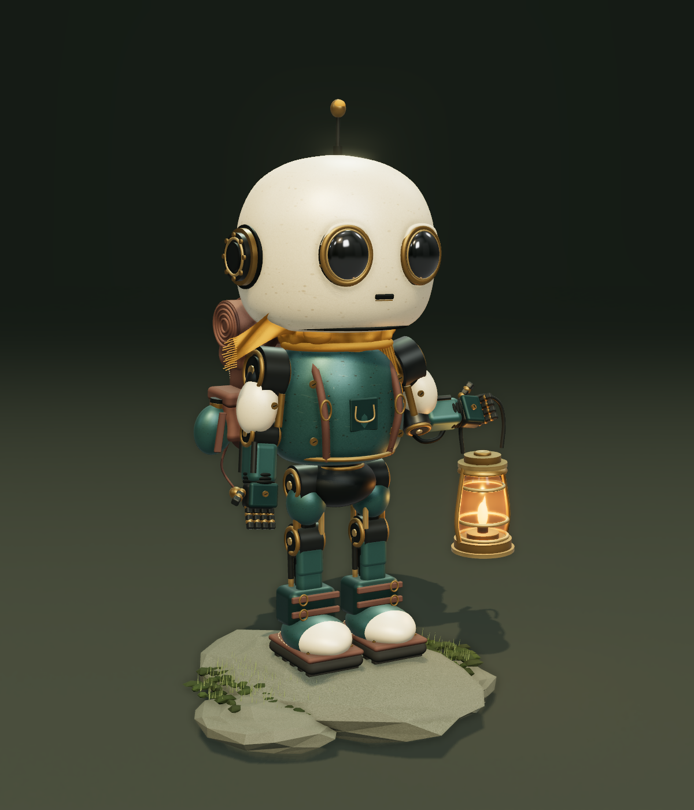

# NOMAD — 灯りを運ぶ旅人

コンセプト画像を参考に、形状・素材・装備・動作を新しく組み立てた3Dキャラクターです。

**Created by CORN · Published by HFOT**

[公開ビューア](https://hfot.github.io/nomad-3d/) · [アニメーション付きGLB](https://hfot.github.io/nomad-3d/NOMAD-animated.glb)

## ローカルで開く

**START.bat をダブルクリック**してください。ブラウザでビューアが開きます。
このPCにある Node.js を使用します。制作フォルダと `node_modules` を一緒に保管してください。
起動後は http://127.0.0.1:8846 からも開けます。ローカルでの閲覧時に外部通信は不要です。公開版はGitHub Pagesで配信します。

## 操作

- ドラッグ：360°回転。ホイール／ピンチ：拡大。右ドラッグ：平行移動。
- 待機／歩く／手を振る／見回す：動作を滑らかに切り替えます。
- 動きの速さ、一時停止、自動回転を変更できます。
- 黄昏／スタジオ／夜の照明と、仕上げ／クレイ／ワイヤーの表面表示を切り替えられます。
- ランタンの点灯・消灯、原画の表示、PNGでの写真保存に対応しています。
- 「モデルを保存」で、4つの動作と埋め込みテクスチャを含むGLBを保存できます。

## 3Dモデル

`NOMAD-animated.glb` がキャラクター本体です。背景の岩やビューアの文字は含めていません。
599個のメッシュを使い、陶器の頭、光学レンズ、肩・肘・股・膝の機構、分節した指、マフラー、リュック、寝袋、水筒、ブーツ、ガラス入りランタンを立体化しています。
塗装・革・布の色と微細な凹凸は、埋め込みのカラーテクスチャ／法線マップとして保存されています。

| 動作名 | 長さ | 内容 |
| --- | --- | --- |
| Idle | 4秒 | 呼吸のような胴体の揺れ、首・布・ランタンの揺れ |
| Walk | 2秒 | その場歩行、股・膝・足首・腕の連動 |
| Wave | 4秒 | 左手の挨拶、肘と手首の動き |
| Look | 6秒 | 首を左右に振って周囲を確認 |

関節は硬いパーツを親子関係で動かす方式です。18の可動ノードを30fpsでキーフレーム化しています。人型スキンメッシュ／Humanoid共通骨格へのリターゲット用データではありません。
布とランタンの揺れはアニメーションで作っており、物理シミュレーションではありません。
炎の輪郭はGLBに含まれ、光量の細かな明滅と画面の光のにじみはビューア側の演出です。

BlenderなどGLB対応ソフトにインポートして編集できます。この制作環境にはBlender本体がなかったため、`.blend` ファイルの作成・Blender内での確認は行っていません。
原画の写真に近い傷・布の繊維を完全に復元したものではなく、原画を立体向けに再設計したモデルです。

## 制作ファイル

- `model.js`：全形状、素材、テクスチャ生成、4つのアニメーション。
- `viewer.js`：照明、影、環境反射、陰影補助、カメラ、操作、GLB書き出し。
- `index.html` / `style.css`：日本語のビューア画面。
- `preview.png` / `NOMAD-portrait.png`：実際の3D表示。
- `wave.png` / `back.png` / `night.png`：動作、背面、夜の表示。
- `verification.json`：ブラウザ操作・GLB再読み込みの検証記録。
- `gltf-validation.json`：Khronos glTF Validatorによる形式検証。エラー0、警告0、情報指摘0。

描画・ファイル書き出しには Three.js（MIT）を使用しています。
書き出し仕様：[Three.js GLTFExporter](https://threejs.org/docs/pages/GLTFExporter.html)。

## ビルドと公開

`npm ci` → `npm run check` → `npm run build` で `dist/` に静的配信ファイルを生成します。mainブランチへのpushでGitHub ActionsがGitHub Pagesへデプロイします。外部API、アカウント登録、アクセス解析は使用していません。
